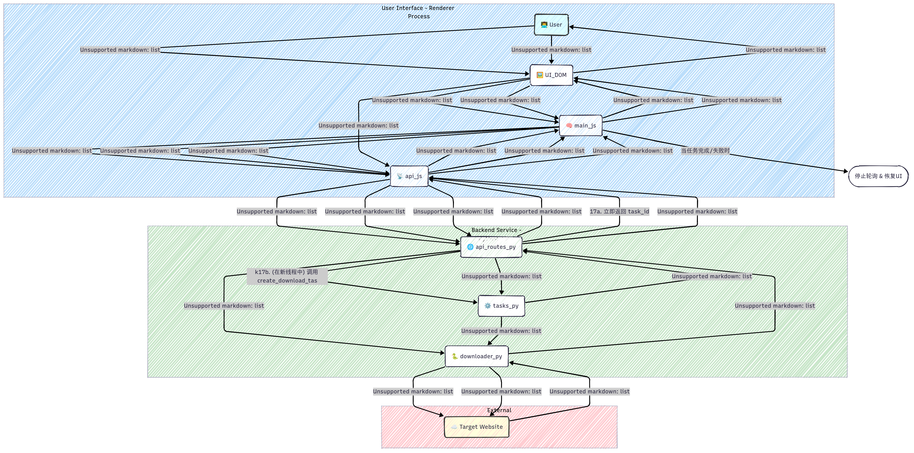

# 应用架构与逻辑流

本文档旨在详细阐述 Advanced Video Downloader 的内部工作原理，包括其三大核心组件的职责以及它们之间的交互方式。

## 概览

本应用采用了一个经典的三体架构：

1.  **Electron 主进程 (Host)**: 应用程序的守护者和协调者。
2.  **Electron 渲染器进程 (Frontend)**: 用户所见的图形界面 (UI)。
3.  **Python 子进程 (Backend)**: 负责所有繁重任务的“引擎”。

---

## 核心组件详解

### 1. Electron 主进程 (`electron/`)

**职责**:
- 创建和管理应用窗口 (`BrowserWindow`)。
- 启动和管理 Python 后端子进程。
- 处理原生操作系统交互（如菜单栏、文件对话框、打开文件夹）。
- 通过 `preload.js` 脚本，安全地向前端暴露系统级API。

**关键文件**:
- `main.js`: 应用的入口点。负责 `app` 的生命周期事件，创建窗口。
- `python-manager.js`: **核心模块**。它负责：
    - 使用 `portfinder` 寻找一个空闲端口。
    - 将该端口作为参数，通过 `child_process.spawn` 启动 `backend/app.py`。
    - 监听 Python 进程的 `stdout`，等待 `BACKEND_READY_SIGNAL` 信号，一旦收到，就通过 IPC 将可用端口号通知给前端。
    - 在应用退出时，负责终止 Python 子进程。
- `ipc-handlers.js`: 集中处理所有来自前端的 IPC 请求 (`ipcMain.handle`)，如 `open-downloads-folder`。
- `preload.js`: 安全的“桥梁”。在启用上下文隔离的前提下，通过 `contextBridge.exposeInMainWorld` 将 `ipcRenderer` 的功能（如 `invoke` 和 `on`）包装成一个安全的 `window.electronAPI` 对象，供前端 JavaScript 调用。

### 2. 前端 / 渲染器进程 (`frontend/`)

**职责**:
- 渲染用户界面。
- 捕获用户的所有输入和操作（点击、输入URL等）。
- 通过 `api.js` 与 Python 后端进行 HTTP 通信。
- 通过 `preload.js` 暴露的 `window.electronAPI` 与主进程通信。

**关键文件**:
- `index.html`: 应用的UI结构。
- `api.js`: **网络层**。这是一个单例类，封装了所有对后端 Flask API 的 `fetch` 请求。它的 `init()` 方法会等待主进程发来后端端口号，然后构建出 `baseURL` (例如 `http://localhost:51234/api`)。
- `ui.js`: **视图层**。这是一个纯粹的DOM操作模块，负责更新进度条、显示视频信息、启用/禁用按钮等。它不包含业务逻辑，只执行 `main.js` 发出的指令。
- `main.js`: **控制器层**。这是前端的“大脑”，负责所有的业务逻辑。
    - `App` 类持有应用状态（如当前URL、配置信息）。
    - 它协调 `ui.js` 和 `api.js`。例如，当用户点击“Get Info”时，`main.js` 会调用 `api.js` 发送请求，在请求返回后，再调用 `ui.js` 来更新界面。

### 3. Python 后端服务 (`backend/`)

**职责**:
- 提供一个本地 RESTful API 服务。
- 封装 `yt-dlp` 的所有功能，包括获取信息和下载。
- 管理异步下载任务，避免 API 请求被阻塞。
- 处理文件系统操作（查询历史、删除文件）。
- 管理应用的配置文件 (`config.yaml`)。

**关键文件**:
- `app.py`: **Flask 应用入口**。它创建 Flask 实例，注册 API 蓝图，并在主进程指定的端口上启动 Web 服务。
- `api_routes.py`: 定义所有的 API 端点 (Endpoint)，如 `/info`, `/download`, `/progress/<task_id>` 等。
- `downloader.py`: `YouTubeDownloader` 类，是对 `yt-dlp` Python 库的直接封装。
- `tasks.py`: **异步任务管理器**。当收到 `/download` 请求时，它会创建一个唯一的 `task_id`，然后启动一个**新的线程**来执行 `downloader.py` 中的下载方法。这确保了 Flask 主线程不会被长时间的下载任务阻塞。它还负责在内存中（线程安全地）存储和更新每个任务的进度。
- `config.py`: 负责加载、解析、更新和保存 `config.yaml` 配置文件。
- `ytdlp_utils.py`: 一个辅助模块，用于根据前端和全局配置动态构建 `yt-dlp` 所需的复杂参数字典。

---

## 逻辑流程示例：一次完整的下载

1.  **启动**:
    - 用户打开应用，`electron/main.js` 启动。
    - `python-manager.js` 找到空闲端口 (如 `54321`)，启动 `backend/app.py --port 54321`。
    - `backend/app.py` 启动后，向 `stdout` 打印 `BACKEND_READY_SIGNAL`。
    - `python-manager.js` 捕获到信号，通过 IPC `backend-ready` 事件将端口 `54321` 发送给前端。
    - `frontend/api.js` 收到端口，完成初始化。

2.  **获取信息**:
    - 用户在 `index.html` 输入URL，点击“Get Info”按钮。
    - `ui.js` 的事件监听器触发 `main.js` 中的 `app.getVideoInfo()`。
    - `app.getVideoInfo()` 调用 `api.js` 的 `getVideoInfo(url)`。
    - `api.js` 向 `http://localhost:54321/api/info` 发送一个 `POST` 请求。
    - `api_routes.py` 中的 `/info` 路由接收请求，调用 `downloader.get_video_info()`。
    - `downloader.py` 使用 `yt-dlp` 获取元数据，并将结果以 JSON 格式返回。
    - `main.js` 收到成功响应后，调用 `ui.js` 的 `displayVideoInfo()` 方法，后者更新DOM，显示视频详情并**启用“开始下载”按钮**。

3.  **开始下载与进度更新**:
    - 用户选择好格式，点击“开始下载”。
    - `main.js` 的 `app.startDownload()` 被调用。它从 `ui.js` 收集下载选项。
    - `main.js` 调用 `api.js` 的 `startDownload(url, options)`。
    - `api.js` 向 `http://localhost:54321/api/download` 发送 `POST` 请求。
    - `api_routes.py` 中的 `/download` 路由接收请求，调用 `tasks.create_download_task()`。
    - `tasks.py` 生成一个 `task_id`，将任务状态设为 `queued`，并**启动一个新线程**来执行下载。然后立即将 `task_id` 返回给前端。
    - `main.js` 收到 `task_id` 后，调用 `startProgressMonitoring(task_id)`，启动一个 `setInterval` 定时器。
    - 定时器每秒向 `http://localhost:54321/api/progress/<task_id>` 发送 `GET` 请求。
    - 与此同时，在后端的下载线程中，`yt-dlp` 的 `progress_hook` 会被触发，它调用 `tasks._update_task_progress()` 来更新内存中该任务的状态 (百分比、速度等)。
    - 前端的轮询请求从 `tasks.get_task_status()` 中获取到最新的进度，并通过 `ui.js` 实时更新进度条。
    - 当后端下载线程完成或出错时，它会将任务状态更新为 `completed` 或 `error`。
    - 前端的下一次轮询获取到这个最终状态后，会停止定时器，恢复UI，并刷新下载历史列表。
