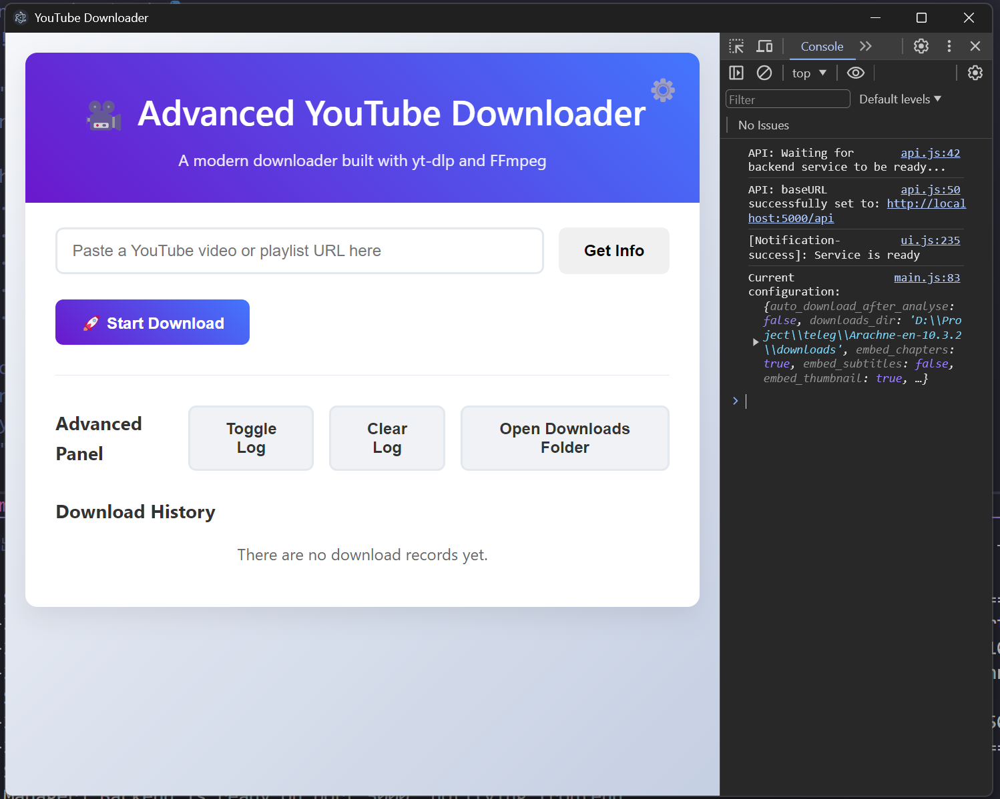

# 🚀 Advanced YouTube Downloader

<p align="center">
  <div style="display: flex; justify-content: center; gap: 5px;">
    <a href="https://www.electronjs.org/" title="Electron">
      
    </a>
    <a href="https://discord.gg/BNvHMDr7" title="Discord">
      
    </a>
    <a href="https://t.me/+dHEs5v_mLfNjYjk0" title="Telegram">
      
    </a>
  </div>
  
  <div style="display: flex; justify-content: center; gap: 5px; margin-top: 5px;">
    <a href="https://opensource.org/licenses/MIT" title="License: MIT">
      
    </a>
    <a href="#" title="Version">
      
    </a>
    <a href="https://www.python.org/" title="Python">
      
    </a>
    <a href="https://flask.palletsprojects.com/" title="Flask">
      
    </a>
    <a href="https://github.com/yt-dlp/yt-dlp" title="yt-dlp">
      
    </a>
    <a href="https://dotnet.microsoft.com/zh-cn/download/dotnet/latest/runtime" title="Platform: Windows">
      
    </a>
  </div>
</p>

A modern, cross-platform YouTube video downloader built with **Electron**, **Python/Flask**, **yt-dlp**, and **FFmpeg**, featuring a powerful and flexible graphical user interface.



---

## ✨ Core Features

- **Modern GUI**: Built with Electron to provide a native, smooth, cross-platform user experience.
- **Powerful Download Core**: Uses `yt-dlp` as the backend engine, supporting videos, playlists, channels from YouTube, and is compatible with thousands of other websites.
- **High-Performance Backend**: A lightweight Python backend powered by Flask, handling download tasks with multi-threading to prevent UI blocking.
- **High Concurrency Downloads**: Supports multiple tasks downloading simultaneously, with a configurable concurrency limit in the settings.
- **Rich Download Options**:
  - **Format Selection**: Freely choose between video (mp4, mkv, webm) or audio-only (mp3, m4a, ogg, wav) formats.
  - **Quality Control**: Supports a wide range of resolution options from the highest quality (8K/4K) to the lowest.
  - **Metadata Embedding**: Automatically embeds cover art, chapters, and subtitles into the final media file.
- **Advanced Network Features**:
  - **Proxy Support**: Built-in comprehensive proxy settings to easily handle various network restrictions.
  - **Aria2c Acceleration**: Supports integration with `aria2c` for multi-threaded high-speed downloads.
- **Download & Configuration Management**:
  - **Centralized Configuration**: All application settings are saved in an auto-generated `config.yaml` file, making customization and backup convenient.
  - **Download History**: Automatically records completed downloads, allowing you to view, open file locations, or delete files at any time.

---

## 🛠️ Tech Stack

- **Main Framework (GUI)**: **Electron**
- **Backend Service**: **Python 3.8+** & **Flask**
- **Core Downloader**: **yt-dlp**
- **Media Processing**: **FFmpeg**
- **Frontend Interface**: **HTML / CSS / Vanilla JavaScript** (No frontend framework)
- **Dependency Management**: **Node.js/npm** (Frontend), **pip** (Backend)

---

## 📂 Project Structure

```
youtube-downloader/
├── backend/                  # Contains all Python backend code
│   ├── app.py                # Flask application entry point, responsible for starting the service
│   ├── api_routes.py         # Defines all Flask API routes
│   ├── config.py             # Configuration management (config.yaml)
│   ├── downloader.py         # Core downloader class (wraps yt-dlp)
│   ├── tasks.py              # Background download task management (multi-threading)
│   └── ytdlp_utils.py        # Utility for building yt-dlp parameters
│
├── electron/                 # Contains all Electron main process code
│   ├── main.js               # Electron application main entry point
│   ├── ipc-handlers.js       # IPC communication handlers between main and renderer processes
│   ├── menu.js               # Defines the application's top menu bar
│   ├── preload.js            # Secure preload script (context bridge)
│   └── python-manager.js     # Starts and manages the Python child process
│
├── frontend/                 # Contains all frontend interface code (renderer process)
│   ├── css/style.css         # Stylesheet for the interface
│   ├── js/api.js             # Encapsulates network requests to the backend API
│   ├── js/main.js            # Main frontend logic (business flow)
│   └── js/ui.js              # Encapsulates all DOM manipulation and UI updates
│   └── index.html            # Main page of the application
│
├── scripts/                  # Contains helper scripts
│   └── setup.py              # One-click environment setup script
│
├── assets/                   # Contains static assets like app icons, screenshots, etc.
│
├── config.yaml               # (Auto-created) The core configuration file for the application
├── package.json              # Node.js dependencies and project information
├── requirements.txt          # List of Python dependencies
└── README.md                 # This document
```

---

## 🏁 Getting Started

Please follow the steps below to set up and run this project on your local machine.

### 1. Prerequisites

Before you begin, ensure you have the following software installed:

- **Node.js**: `v18.x` or newer (LTS recommended).
- **Python**: `v3.8.x` or newer.
- **FFmpeg**: **Must** be installed and added to your system's `PATH` environment variable.
  - **Windows (Recommended)**:
    - Using Scoop: `scoop install ffmpeg`
    - Or using Chocolatey: `choco install ffmpeg`
  - **macOS (Recommended)**:
    - Using Homebrew: `brew install ffmpeg`
  - **Linux (Debian/Ubuntu)**:
    - `sudo apt update && sudo apt install ffmpeg`

### 2. Installation Steps

**Step 1: Clone the repository**```bash
git clone https://github.com/your-username/your-repository.git
cd your-repository
```
*(Please replace the URL with your own repository address)*

**Step 2: Run the one-click setup script**
We provide a convenient Python script to automate all environment setup, including installing Python and Node.js dependencies, creating necessary directories, etc.

Run in the project root directory:
```bash
python scripts/setup.py
```
After the script executes successfully, your development environment is ready.

### 3. Launching the Application

- **Development Mode** (with hot-reloading and developer tools):
  ```bash
  npm run dev
  ```

- **Production Mode** (simulates the state after packaging):
  ```bash
  npm start
  ```
This command will simultaneously start the Electron main process and the Python backend service, and display the application window.

---

## ⚙️ Application Configuration

- When the application is first launched, a `config.yaml` file will be automatically created in the project root directory.
- You can modify common settings through the **Settings (⚙️)** button in the upper-right corner of the application interface.
- For advanced users, you can also directly edit the `config.yaml` file to customize more advanced options. All changes will take effect the next time the application starts.

---

## 📜 License

This project is licensed under the [MIT License](LICENSE).


