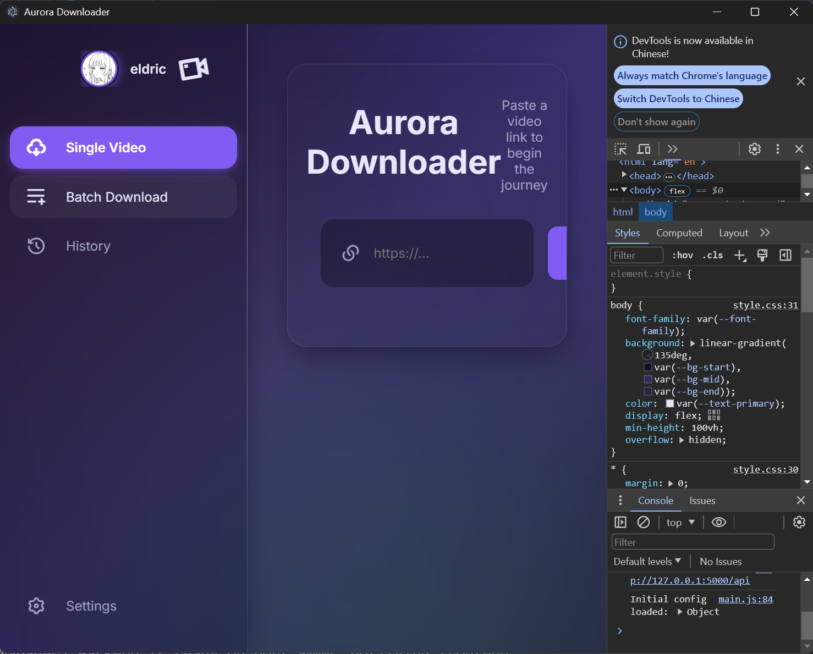

# Aurora Downloader

[](https://opensource.org/licenses/MIT)
[](https://www.electronjs.org/)
[](https://www.python.org/)
[](https://flask.palletsprojects.com/)
[](https://github.com/yt-dlp/yt-dlp)
[](https://ffmpeg.org/)

# 注意事项

1. 再次检查了代码的逻辑；
2. 统一了注释，将注释全部设置为English；
3. 调整了前后端的耦合性程度；
4. 更新了各个解释性文件；



A modern, cross-platform desktop application for downloading videos, built with a powerful Python backend and a sleek Electron frontend. Aurora Downloader leverages the strength of `yt-dlp` to provide a seamless and robust video downloading experience.

---

## ✨ Key Features

*   **High-Quality Downloads**: Powered by `yt-dlp`, supporting a vast number of websites and formats.
*   **Sleek & Modern UI**: A beautiful, "glassmorphism" inspired interface with dynamic aurora effects.
*   **Single & Batch Downloads**: Download a single video with specific options, or queue up a list of URLs for batch processing.
*   **Rich Format Support**: Download videos as MP4, MKV, WebM, or extract audio-only to MP3.
*   **Customizable Settings**: Control max concurrent downloads, apply speed limits, use proxies, and more.
*   **Download History**: Easily view and manage all your completed downloads.
*   **Cross-Platform**: Built with Electron and Python, designed to run on Windows, macOS, and Linux.
*   **Privacy-Focused**: All operations, configurations, and downloads happen locally on your machine. No data is collected or sent to external servers.

---

## 🚀 Tech Stack

Aurora Downloader is a hybrid application, combining the strengths of different technologies:

*   **Frontend (Renderer Process)**:
    *   HTML5, CSS3, Vanilla JavaScript (ES6+)
    *   No frameworks, just clean, modular code.
*   **Desktop Shell (Main Process)**:
    *   **Electron**: Enables the creation of a cross-platform desktop application using web technologies.
*   **Backend (Child Process)**:
    *   **Python**: For core processing and performance-intensive tasks.
    *   **Flask**: A lightweight web server framework to create the API bridge between the frontend and Python.
    *   **yt-dlp**: The heart of the downloading engine, a powerful and actively maintained fork of `youtube-dl`.
*   **Core Dependencies**:
    *   **FFmpeg**: Essential for merging video/audio streams and converting formats.

---

## 📋 Prerequisites

Before you begin, ensure you have the following installed on your system:

1.  **Python**: Version 3.8 or higher.
2.  **Node.js**: LTS version (includes `npm`).
3.  **FFmpeg**: Must be installed and accessible from your system's PATH.

This project includes a setup script that can help you verify your environment and install dependencies.

---

## ⚙️ Installation & Setup

1.  **Clone the Repository**:
    ```bash
    git clone https://github.com/your-username/aurora-downloader.git
    cd aurora-downloader
    ```

2.  **Run the Automated Setup Script**:
    This script will check your environment, create necessary directories, and install all Python and Node.js dependencies.
    ```bash
    python setup.py
    ```
    *If the script reports that FFmpeg is missing, please follow the on-screen instructions to install it for your operating system.*

3.  **Start the Application**:
    *   **For Development (with auto-reloading)**:
        This command uses `nodemon` to watch for changes in the `electron` directory and automatically restarts the app.
        ```bash
        npm run dev
        ```
    *   **For Production Mode**:
        This command runs the application directly.
        ```bash
        npm start
        ```

---

## 🏗️ Project Structure

The project is logically divided into three main parts:

```
/
├── backend/          # Python Flask backend
│   ├── app.py        # Main Flask app setup and entry point
│   ├── api_routes.py # All API endpoint definitions
│   ├── config.py     # Handles config.yaml loading and saving
│   ├── downloader.py # The core yt-dlp wrapper class
│   └── tasks.py      # Manages background download threads and state
│
├── electron/         # Electron main process files
│   ├── main.js       # Main Electron application entry point
│   ├── python-manager.js # Spawns and manages the Python backend process
│   ├── ipc-handlers.js   # Secure handlers for renderer -> main communication
│   └── preload.js    # Security bridge between renderer and main processes
│
├── frontend/         # UI files (HTML, CSS, JS)
│   ├── index.html    # Main application window layout
│   ├── js/           # All frontend JavaScript logic
│   │   ├── main.js   # Application controller and state management
│   │   ├── api.js    # Handles all communication with the Python API
│   │   └── ui.js     # Handles all DOM manipulation and event listening
│   └── css/          # Stylesheets
│
├── setup.py          # Automated environment setup script
├── package.json      # Node.js dependencies and build scripts
└── requirements.txt  # Python dependencies

```

